[ranvirsingh.15h@gmail.com](mailto:ranvirsingh.15h@gmail.com) &nbsp;·&nbsp;
[github.com/RanvirxD](https://github.com/RanvirxD) &nbsp;·&nbsp;
[linkedin.com/in/rait-ranvir-singh](https://linkedin.com/in/rait-ranvir-singh) &nbsp;·&nbsp;

> CS undergrad at SGT University, in Gurugram. 
> Small, sharp tools over big vague ideas.

I build fast, test on real users, and kill what doesn't work. Right now that's 
[dsa-versus](https://github.com/RanvirxD) — a real-time competitive coding battle platform 
where you solve against a live opponent on a shared timer. Also [medflow](https://github.com/RanvirxD) 
and [redditor](https://github.com/RanvirxD/redditor), a 19-language code translation engine.

<samp>javascript &nbsp; typescript &nbsp; python &nbsp; java &nbsp; c++ &nbsp; react &nbsp; next.js &nbsp; node &nbsp; express &nbsp; tailwind &nbsp; postgres &nbsp; mongo &nbsp; docker &nbsp; aws &nbsp; git &nbsp; linux</samp>

**[dsa-versus](https://github.com/RanvirxD)** &nbsp;·&nbsp; <samp>next.js, react, supabase</samp> 
Real-time competitive coding battles: head to head, shared live timer, 
rankings, and a sandboxed judge — state synced live across every client.

**[medflow](https://github.com/RanvirxD)** &nbsp;·&nbsp; <samp>mongo, node</samp> 
Hospital management and referral system, a state-level hackathon finalist. 
Location-aware hospital discovery and live bed, ICU, staff and equipment tracking.

**[redditor](https://github.com/RanvirxD/redditor)** &nbsp;·&nbsp; <samp>javascript, ast, llm</samp> 
Multi-language code translation with an AST-based parser fused with LLM 
inference — sub-second conversion across 19+ languages. [Live](https://redditorcode.vercel.app).

This is a a about me section.
Do checkout my portfolio : https://ranvirxd.github.io/